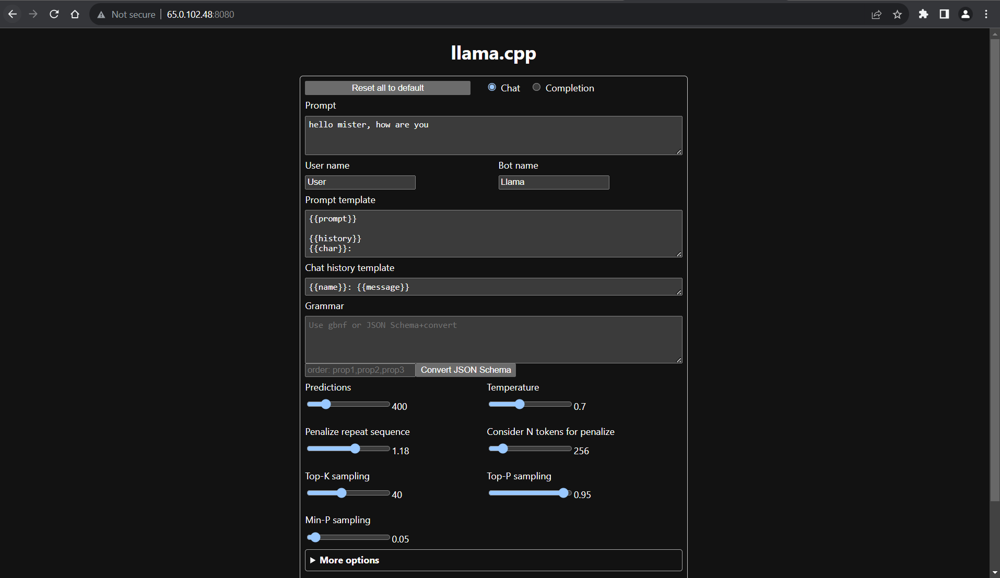
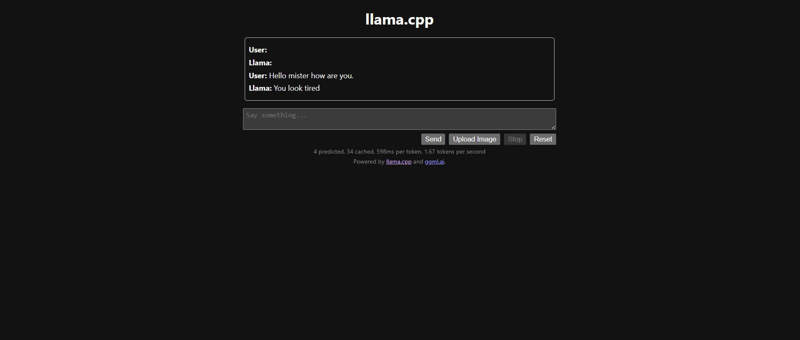

# LLM on CPU (EMLO assignment 28)
This project focuses on using Large Language Model on Intel CPU. Also it is part of assignemt from EMLO.

## Introduction
In this project, we will be using [llama.cpp](https://github.com/ggerganov/llama.cpp) to run inference using LLM model on CPU. 

We will be also be generating JSON file format by giving certain text.

## Prerequisite
Following are the prerequisite to run this project:
- make installed. `apt-get install make`. make will be used for both kind of inference.
- `Docker`, if planning to use docker based inference.
- `git`, if not installed.

## Steps to perform inference
Two type of inference setup can be performed. Either you can use docker or you can setup this locally.

NOTE: This repo utilizes Makefile. For more information checkout Makefile of this repo.

#### Selected LLM model:
Before looking to inference setup, lets discuss about the model used for this inferencing.

This repo is using a pre-converted GGUF model file from huggingface by `TheBloke`. `yayi2-30B-llama-GGUF` is a 30B parameter model.

We are using `Q2_k` quantized model for our inference.

### 1. Inference using Docker:
Below are the steps to perform docker inference.
1. Build the docker image. Run `make build-docker`. This will build the docker image and will install llama.cpp in it.
2. Download the GGUF model. Run command `make get-model`. This will download required model.
3. Run a sample inference for testing. Run `make run-sample-docker`. This will run a sample inference and will generate a json format output.

#### ⭐Start a docker server:
You can also start a server in docker and can access the UI on `localhost:8080`
- Run following command, `make deploy-server-docker`.
- Open url `localhost:8080`

### 2 Inference on Local host:
Inference on localhost is also very similar but it does setup llama.cpp directly on host instead of docker. Below are the steps:
1. Build and setup llama.cpp locally. Run `make build-local`. This will install required package and will pull and build llama.cpp repo.
2. Download the GGUF model file. Run `make get-model`.
3. Run a sample inference. Run `make run-sample-local`. 

#### ⭐Start a local server:
You can similarly start server locally and can access the UI on `localhost:8080`
- Run following command, `make deploy-server-local`.
- Open url `localhost:8080`

## Output
Below are images of the server UI deployed in AWS EC2:
Deploy:

Inferece:


<br>
Here are the inference output in json format:

```
man name Josh has a car from ford company it was launchd on year 1994; josn:{ "car": 

   { "make": "Ford", "model":"Mondeo","year":2086,"colors": ["blue"]},
     "owner":{"firstName":"Josh ","lastName":"Cox}",
          "age":37}} [end of text]
```
more output and grammer file can be found in `output.md`.